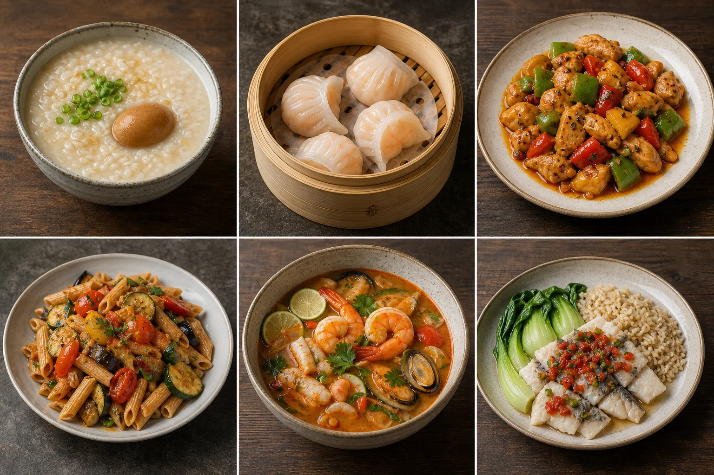

# 味衡 MealAtlas

> 看得懂营养、改得动食谱的一日三餐终端。



MealAtlas 解决的不是“再给我一万道菜”，而是更具体的日常困境：**明天吃什么？这顿太油了，怎么改才仍然好吃？**

它会为早餐、午餐和晚餐生成一套可解释的菜单。每餐可以独立切换菜系或重抽；点一下“减脂改良”，配方变化和全天营养差值会立刻呈现，也可以随时恢复原版。

## Highlights

- 🎛️ **三餐调音台**：换一道只改变当前餐，不推倒整天计划。
- 🥢 **中国菜系索引**：覆盖八大菜系、34 个省级行政区相关风味及重要跨地域传统；无审校食谱的条目明确标注建设中。
- 🌍 **世界经典菜系**：地中海、意大利、俄国、东欧、美洲、泰国、东南亚等均进入可扩展分类层。
- 🧮 **11 项营养字段**：能量、三大宏量营养素、水、纤维、钠、钙、铁、维生素 A/C。
- ✨ **改良可解释**：少多少油、换多少主食、补什么蛋白，都有配方级记录和营养差值。
- 📖 **完整做法**：每道演示食谱包含克数、步骤、过敏原、耗时与公开教程检索入口。
- 🔎 **数据置信等级**：演示估算值不会伪装成实验室检测或医疗处方。
- 📱 **响应式 PWA 外壳**：桌面、平板、手机可用，并带 GitHub Pages 自动部署。

## Quick start

需要 Node.js 22+ 与 pnpm 11+。

### 最简单：Windows 双击启动

直接双击项目根目录的 **`打开网站.cmd`**。脚本会启动仅限本机访问的网站并自动打开：

```text
http://127.0.0.1:4173/
```

请保持弹出的“味衡 MealAtlas 本地网站”窗口开启；关闭窗口或按 `Ctrl+C` 后网站会停止。

### 开发模式

```bash
pnpm install
pnpm dev
```

质量检查：

```bash
pnpm test
pnpm build
pnpm preview
```

## Project structure

```text
src/
├─ components/       # 菜品卡、营养仪表、详情抽屉、菜系索引
├─ data/             # 类型化食谱与菜系覆盖数据
├─ lib/              # 确定性随机、评分、汇总与测试
├─ App.tsx            # 产品状态与主界面
└─ styles.css         # 无运行时依赖的响应式视觉系统
docs/
├─ research-brief.md  # 竞品、设计、技术与失败案例研究
└─ data-methodology.md# 营养口径、来源和安全边界
```

## How the planner works

首版使用可解释的启发式评分，而不是声称使用“神秘 AI”：

1. 以餐次和用户明确选择的菜系作为筛选条件；
2. 按目标对蛋白质密度、纤维、能量和脂肪加权；
3. 从高分候选中使用日期种子抽取，保证同一日期可复现；
4. 聚合全天营养，显示目标完成度；
5. 改良只替换当前食谱的显式营养版本。

没有可用食谱的菜系会退回通用候选并在菜系索引中提示“仍在校对”，不会现场捏造一道菜。未来数据量足够后，可把评分器替换为带硬约束的整数/目标规划。

## Data honesty

当前 12 道食谱是交互原型数据，营养值均标为 `estimated`。生产版计划接入：

- [USDA FoodData Central](https://fdc.nal.usda.gov/api-guide/)：基础食材与 FNDDS；
- [Open Food Facts API v3](https://openfoodfacts.github.io/openfoodfacts-server/api/)：包装食品，并遵守 ODbL 与数据质量警告；
- 有明确许可和版本的中国食物成分数据源。

完整口径见 [数据与营养计算方法](./docs/data-methodology.md)。本项目不能替代医生或注册营养师，尤其不为孕产妇、儿童、肾病、糖尿病、进食障碍等临床场景自动开具处方。

## Design research

设计前研究了 RecipeSage、Tandoor、Mealie、Eat This Much，以及来自 YouTube、Behance、Dribbble 和 Reddit 的制作流程与失败复盘。可复现记录、许可、采集日期、三条候选路线与验收标准见 [研究简报](./docs/research-brief.md)。

## Food images

首批六张菜品摄影由 Codex 内置 ImageGen 生成后裁切为 WebP。创作提示词强调自然窗光、真实家常纹理、低油感、无文字水印，并明确排除 CGI 光泽、夸张蒸汽与不可能的摆盘。它们是项目自有的演示资产，不是求解器结果或真实营养检测照片。

## GitHub Pages

仓库已经包含 `.github/workflows/deploy.yml`。在 **Settings → Pages → Source** 选择 **GitHub Actions**，推送到 `main` 即可构建、测试并部署。Vite 使用相对 `base`，仓库名无需硬编码。

第一次创建仓库、推送和以后更新的完整说明见 [GitHub 发布指南](./docs/github-publishing-guide.md)。

## Roadmap

- [ ] 食材级 USDA / 合规中国数据库适配器与缓存
- [ ] 过敏原硬约束、宗教饮食和家庭多人份
- [ ] 购物清单与“冰箱里已有”优先级
- [ ] 中国地方菜谱审校工作流与贡献证据卡
- [ ] 以可行性诊断为核心的整数/目标规划器
- [ ] 多语言、离线缓存与可安装图标

## Contributing

欢迎补充地方菜系、验证食谱与数据适配器。请先阅读 [CONTRIBUTING.md](./CONTRIBUTING.md)：新食谱必须包含来源、克数、营养口径和图片授权说明。

## License

Code is licensed under the [MIT License](./LICENSE). Third-party data remains subject to its source license and attribution requirements.
